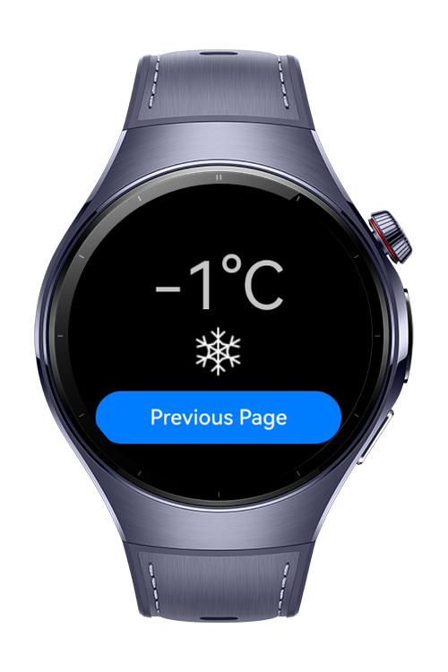
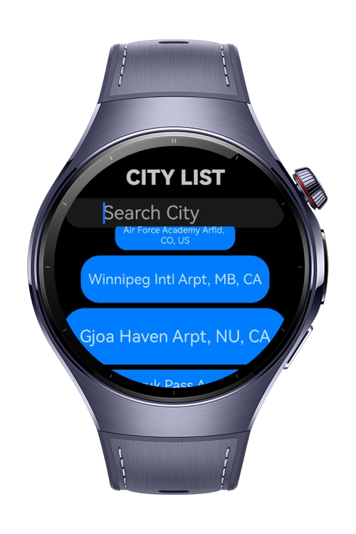
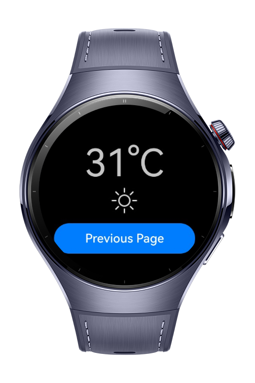

> **Note:** To access all shared projects, get information about environment setup, and view other guides, please visit [Explore-In-HMOS-Wearable Index](https://github.com/Explore-In-HMOS-Wearable/hmos-index).

# Weather App

Simple weather application designed to provide instant temperature information for various cities. Users can easily check the current weather with just one click.

# Preview

<div>
   
   
   
</div>

# Use Cases

Weather App is a lightweight weather application that allows users to instantly view real-time temperatures of different cities through a simple city list interface. By selecting a city, the current temperature is displayed on the screen, making it quick and convenient to check the weather anytime.

1. City Temperature Check: Users select a city (e.g., Berlin, London, Rome) from the list to instantly view its current temperature.

2. Quick Decision Making: While preparing to go out, users can quickly see the temperature to decide what to wear.

3. Travel Planning: Users compare temperatures across multiple cities to plan trips or daily activities.

4. Minimalist Interface: With a clean design, the app ensures fast and distraction-free access to weather information.

5. Lightweight & Efficient: Runs smoothly with minimal resource usage, optimized for quick daily checks.

# Tech Stack

- **Languages**: ArkTS
- **Frameworks**: HarmonyOS SDK 5.0.4(16)
- **Tools**: DevEco Studio Vers 5.1.0.842
- **Libraries**: @kit.ArkUI, @kit.RemoteCommunicationKit

# Project Directory

   ```
   entry/src/main/ets/
   |---model
   |   |---CityModel.ets                // Contains the API requests. Commented out because we are working with mock data
   |   |---Interface.ets                // Contains mock data
   |---pages
   |   |---Temperature.ets              // UI file that allows the icon to change when the temperature changes depending on a given condition           
   |   |---Index.ets                    // Home Page
   |---view
   |   |---SearchCity.ets               // Search component
   |---viewmodel   
   |   |---Service.ets                  // Singleton Instance
   ```

# Constraints and Restrictions
## Suported Devices
- Huawei Watch 5

# License
**WeatherApp** is distributed under the terms of the MIT License
See the [LICENSE](./LICENSE) for more information.
