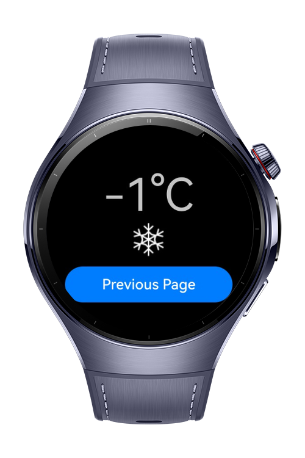
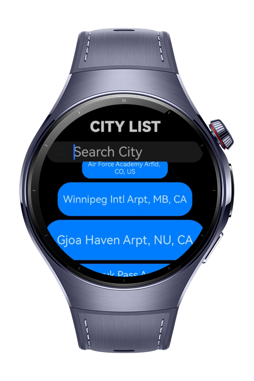
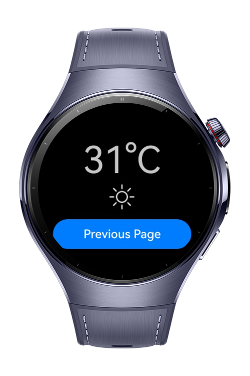

# Weather App

Simple weather application designed to provide instant temperature information for various cities. Users can easily check the current weather with just one click.

# Preview

<div>
   
   
   
</div>

# Use Cases

Weather App is a lightweight weather application that allows users to view temperatures and live weather details for different cities through a watch-friendly city list interface. Users can search, filter, sort, favorite cities, switch temperature units, and open a compact detail screen with cached/live weather data.

1. City Temperature Check: Users select a city (e.g., Berlin, London, Rome) from the list to instantly view its current temperature.

2. Quick Decision Making: While preparing to go out, users can quickly see the temperature to decide what to wear.

3. Travel Planning: Users compare temperatures across multiple cities to plan trips or daily activities.

4. Minimalist Interface: With a clean design, the app ensures fast and distraction-free access to weather information.

5. Lightweight & Efficient: Runs smoothly with minimal resource usage, optimized for quick daily checks.

- Favorite cities are persisted and always shown before other cities.
- Celsius/Fahrenheit unit toggle is stored across launches.
- City search, hot/cold/name sorting, and country-code filtering.
- Live weather refresh through Open-Meteo when a city is opened.
- Cached weather data is reused when live refresh is unavailable.
- Detail view uses swipeable metric pages for temperature, feels-like temperature, humidity, weather code/condition, wind speed, wind direction, precipitation, cloud cover, pressure, day/night state, UV index, source, and last updated time.
- Wearable-first controls with larger touch targets, compact city names, and icon-style back/favorite actions.

# Tech Stack

- **Languages**: ArkTS
- **Frameworks**: HarmonyOS SDK 5.0.4(16)
- **Tools**: DevEco Studio Vers 5.1.0.842
- **Libraries**: @kit.ArkUI, @kit.ArkData, @kit.NetworkKit, @kit.ArkTS, @kit.AbilityKit, @kit.CoreFileKit, @kit.PerformanceAnalysisKit

# Directory Structure

   ```
   entry/src/main/ets/
   |---model
   |   |---Interface.ets                // Weather data model
   |---pages
   |   |---Temperature.ets              // UI file that allows the icon to change when the temperature changes depending on a given condition           
   |   |---Index.ets                    // Home Page
   |---view
   |   |---SearchCity.ets               // Search component
   |---viewmodel   
   |   |---Service.ets                  // Singleton service for preferences, cache, sorting, and live weather requests
   ```

# Constraints and Restrictions
## Supported Devices
- Huawei Watch 5

# License
**WeatherApp** is distributed under the terms of the MIT License
See the [LICENSE](./LICENSE) for more information.
